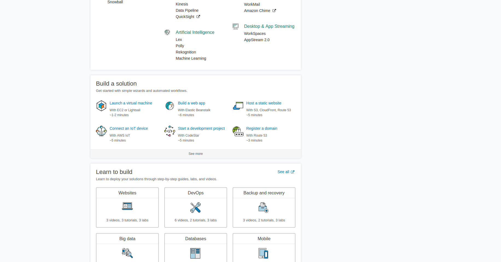
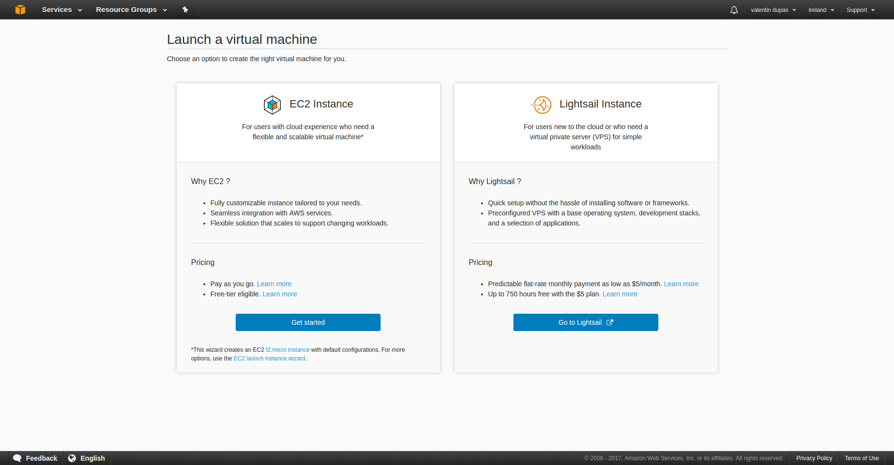
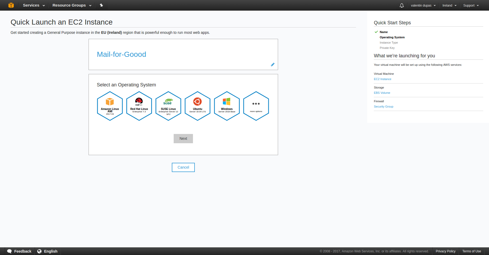
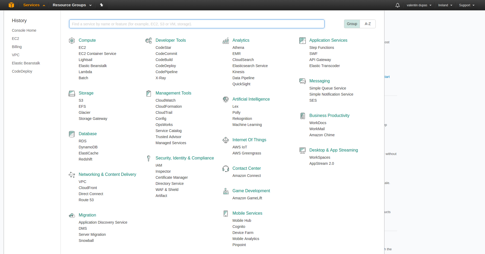
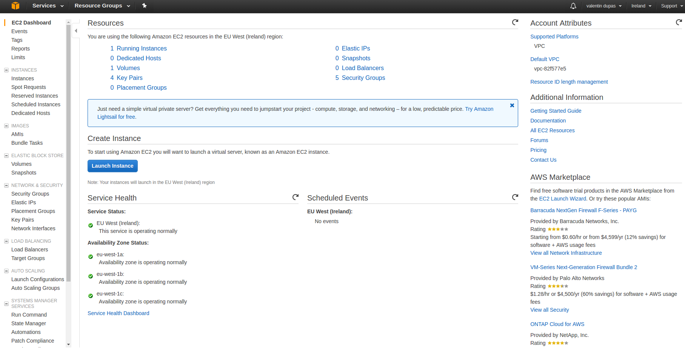
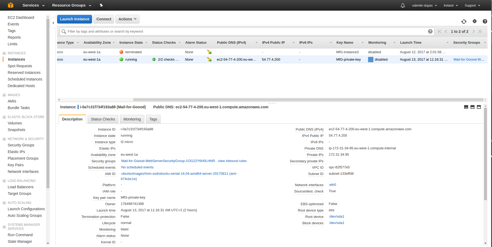
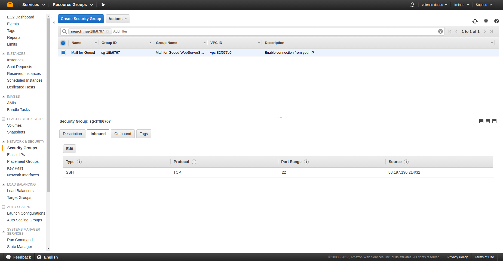
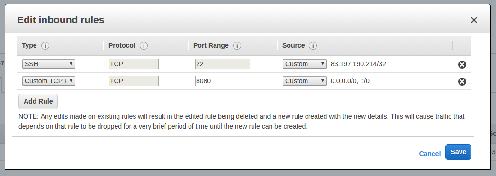
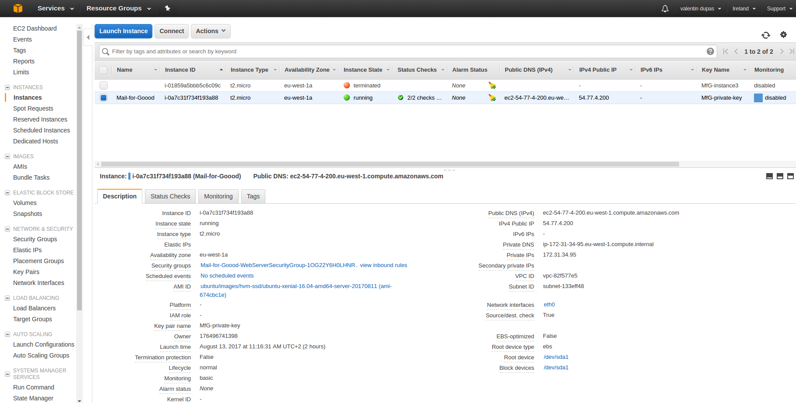

# Deploying Mail for Good on AWS

### Get up and running on Amazon

Right after you log in to AWS you will land on this page.


Scroll down until you see the "build a solution" box as below, then select "Launch a virtual machine".



Click on the "Get started" button in the "EC2 Instance" box.



Give your instance a name. In this example, we will go with "Mail-for-Good"


Select Ubuntu as your operating system.



Here the preselected instance is fine. (t2.micro instances are eligible for the free tier).


AWS will now create an SSH key for your instance. You will need this file to login to the remote server.

We will call this file `MfG-private-key`.


AWS will now create your instance.


You should see this when it's done.


### Configure your AWS instance

In the navbar at the top of the screen select "EC2" under the "Compute" category.



In the menu on the left of your screen, click on "Instances"



Then scroll the box containing the instances to the far right until you see "Security Groups".



Click on the security group of your instance and open the "Inbound" tab



then "Edit".



Add the following rule, as pictured:

```
type: custom tcp rule
protocol: tcp
port range: 80
source: custom 0.0.0.0/0, ::/0
```

### Allocate a static IP to your instance

By default AWS will allocate you a new address every time your instance starts up.

To get a static IP go to navbar -> EC2 -> left menu -> Elastic IPs.


Then click on "Allocate new address".


Once your Elastic IP is created click on Actions -> "Associate address".


Leave the Resource Type as its default ("Instance").

Select the Instance you just created and its Private IP.


### Connect to your new EC2 server

In the navbar at the top of your screen select "EC2" under the "Compute" category.


In the menu on the left of your screen, click on "Instances".


Select your instance. Then take note of the "Public DNS (IPv4)" of your application. In this case, ours is "ec2-54-77-4-200.eu-west-1.compute.amazonaws.com".



---

###### In the commands below, you'll need to replace what's between < and > with what is described.

---

Copy the private key you downloaded earlier and put it somewhere safe. By default, it will probably be in `~/Downloads`. You can check this with:

```
cd ~/Downloads && cat ./MfG-private-key.pem
```

We'll assume this is true and copy the key to our home directory (you may wish to do otherwise, bear this in mind):

```
cp ~/Downloads/MfG-private-key.pem ~/
```

Before using your key you will need to make it readable by running:

```
chmod 400 <path to your key>
```

Which would be the following command for our example:

```
chmod 400 ~/MfG-private-key.pem
```

Log into your instance:

```
ssh -i "<path to the key file you downloaded earlier>" ubuntu@<your Public DNS (IPv4) from Amazon>
```

In our example we would use this command:

```
ssh -i "~/MfG-private-key.pem" ubuntu@ec2-54-77-4-200.eu-west-1.compute.amazonaws.com
```

If everything went well so far you should see the following text:

```
Welcome to Ubuntu 16.04.3 LTS (GNU/Linux 4.4.0-1030-aws x86_64)

 * Documentation:  https://help.ubuntu.com
 * Management:     https://landscape.canonical.com
 * Support:        https://ubuntu.com/advantage

  Get cloud support with Ubuntu Advantage Cloud Guest:
    http://www.ubuntu.com/business/services/cloud

0 packages can be updated.
0 updates are security updates.


The programs included with the Ubuntu system are free software;
the exact distribution terms for each program are described in the
individual files in /usr/share/doc/*/copyright.

Ubuntu comes with ABSOLUTELY NO WARRANTY, to the extent permitted by
applicable law.

To run a command as administrator (user "root"), use "sudo <command>".
See "man sudo_root" for details.
```

You are now logged in to your instance.

### Install docker and docker-compose on your instance

---
###### From this point onwards all commands should be run on the AWS Instance you just logged in to.

###### The installation process for docker is described in more detail at https://docs.docker.com/engine/installation/linux/docker-ce/ubuntu/. Check this out for more details.
---

Update your package sources:

```
$ sudo apt-get update
```

Install packages to allow `apt` to use a repository over HTTPS:

```
$ sudo apt-get install \
 apt-transport-https \
 ca-certificates \
 curl \
 software-properties-common
```

Add Docker’s official GPG key:

```
$ curl -fsSL https://download.docker.com/linux/ubuntu/gpg | sudo apt-key add -
```

Install the docker version currently marked as "stable":

```
$ sudo add-apt-repository \
 "deb [arch=amd64] https://download.docker.com/linux/ubuntu \
 $(lsb_release -cs) \
 stable"
 ```

To install docker-compose run:

```
sudo apt-get install docker-compose
```

### Get set up with Google authentication

Login to [Google API Manager](https://console.developers.google.com/apis/).

In the left menu, select **Dashboard**. Now select **Enable API**, search for `Google+` and select it. At the top of the screen, ensure it's enabled by clicking on **Enable**.

In the left menu, select **Credentials**. Then click **Create Credentials** > **OAuth client ID**.

Select **Web Application**. Name it as you wish
  - Under **Authorized Javascript Origins** put the “Public DNS (IPv4)” you received from Amazon earlier.
  - Under **Authorized redirect URIs** put your “Public DNS (IPv4)” followed by `/auth/google/callback`.


**Any issues here? Double check that both URLs are preceeded with http://**.

Click **Create**.

### Configure Mail for Good

Clone Mail-for-Good:

```
git clone https://github.com/freeCodeCamp/mail-for-good && cd mail-for-good
```

Create a .env file:

```
cp .env.example .env
```

Edit your .env according to the comments present in it:

```
nano .env
```

In particular, you need to edit these four attributes:

```
  # Your Google Client ID
  # E.g. 1234547812345-12345qrp123459bzcd12345660412345.apps.googleusercontent.com
GOOGLE_CONSUMER_KEY=
  # Your Client Secret
  # E.g abcdefQVw1ghijzeaQklmnop
GOOGLE_CONSUMER_SECRET=
  # The URL Google will send you back to after logging in.
  # It must match what is under "Authorized redirect URIs" in the Google Dashboard exactly
GOOGLE_CALLBACK=
  # A random, preferably long sequence of characters. You do not need to remember this.
ENCRYPTION_PASSWORD=
```

To write your changes, press CTRL+O (then confirm your choice).

Press CTRL+X to exit.

### Launch Mail-for-Good

All done! Run the command below and wait for it to finish. This may take some time:

```
sudo docker-compose up
```

Finally, close the terminal. Do not exit the app before doing so.

### Visit your app

You can now visit the app by visiting your "Public DNS (IPv4)".

In our example we would visit "ec2-54-77-4-200.eu-west-1.compute.amazonaws.com".
